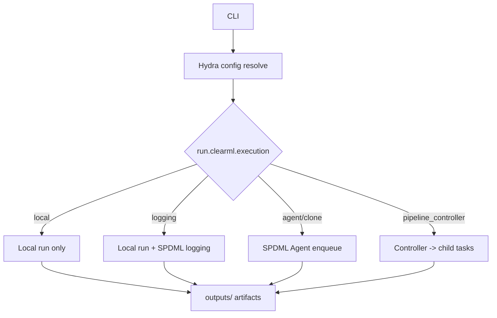

# 実行体の説明

## 1. 実行モード一覧
実行モードは `run.clearml.execution` で切り替えます（設定キー名は歴史的経緯で clearml を使用）。

| 実行モード | 想定用途 | 実行場所 | SPDML連携 | 主要メリット |
| --- | --- | --- | --- | --- |
| local | 開発/デバッグ | ローカル | なし | 最速ループ |
| logging | UI確認/記録 | ローカル | あり | SPDML表示検証 |
| agent | 本番運用 | SPDML Agent | あり | 遠隔実行 |
| clone | 本番運用 | SPDML Agent | あり | テンプレ固定 |
| pipeline_controller | 本番パイプライン | SPDML Agent | あり | 子タスク自動生成 |
| pipeline_controller_local | controller検証 | ローカル + Agent | あり | controllerのみローカル |

## 2. Local 実行
### 2.1 データセット登録
- 設定ファイル: `conf/task/dataset_register/base.yaml`, `conf/data/base.yaml`
- コマンド例:
```bash
python -m tabular_analysis.cli task=dataset_register \
  run.clearml.enabled=false \
  data.dataset_path=/tmp/ta_rehearsal_data/toy_reg.csv data.target_column=target
```

### 2.2 学習パイプライン
- 設定ファイル: `conf/task/pipeline/base.yaml`, `conf/pipeline/model_sets/*.yaml`, `conf/group/*`
- コマンド例:
```bash
python -m tabular_analysis.cli task=pipeline \
  run.clearml.enabled=false \
  data.raw_dataset_id=local:<HASH> data.dataset_path=/tmp/ta_rehearsal_data/toy_reg.csv \
  pipeline.preprocess_variant=stdscaler_ohe pipeline.model_set=regression_all
```

### 2.3 推論
- 設定ファイル: `conf/task/infer/base.yaml`, `conf/group/infer_mode/*`
- コマンド例:
```bash
python -m tabular_analysis.cli task=infer infer.mode=single \
  run.clearml.enabled=false \
  infer.model_id=<MODEL_ID> infer.input_path=/tmp/infer.csv
```

## 3. Local + SPDML 実行（結果登録）
### 3.1 データセット登録
- 設定ファイル: `conf/run/base.yaml`, `conf/task/dataset_register/base.yaml`
- コマンド例:
```bash
python -m tabular_analysis.cli task=dataset_register \
  run.clearml.enabled=true run.clearml.execution=logging \
  data.dataset_path=/tmp/ta_rehearsal_data/toy_reg.csv data.target_column=target
```

### 3.2 学習パイプライン
- 設定ファイル: `conf/task/pipeline/base.yaml`, `conf/exec_policy/base.yaml`
- コマンド例:
```bash
python -m tabular_analysis.cli task=pipeline \
  run.clearml.enabled=true run.clearml.execution=logging \
  data.raw_dataset_id=<RAW_DATASET_ID> \
  pipeline.preprocess_variant=stdscaler_ohe pipeline.model_set=regression_all
```

### 3.3 推論
```bash
python -m tabular_analysis.cli task=infer infer.mode=batch \
  run.clearml.enabled=true run.clearml.execution=logging \
  infer.model_id=<MODEL_ID> infer.batch.inputs_path=/tmp/batch_inputs.csv
```

## 4. SPDML Agent 実行
### 4.1 データセット登録
- 前提: SPDML Agent が起動済み、queue設定済み
- コマンド例:
```bash
python -m tabular_analysis.cli task=dataset_register \
  run.clearml.enabled=true run.clearml.execution=agent run.clearml.queue_name=default \
  data.dataset_path=/tmp/ta_rehearsal_data/toy_reg.csv data.target_column=target
```

### 4.2 学習パイプライン（pipeline_controller）
- テンプレ作成: `python -m tabular_analysis.ops.manage_clearml_templates --apply`
- コマンド例:
```bash
python -m tabular_analysis.cli task=pipeline \
  run.clearml.enabled=true run.clearml.execution=pipeline_controller run.clearml.queue_name=default \
  data.raw_dataset_id=<RAW_DATASET_ID> \
  pipeline.preprocess_variant=stdscaler_ohe pipeline.model_set=regression_all
```

### 4.3 推論
```bash
python -m tabular_analysis.cli task=infer infer.mode=optimize \
  run.clearml.enabled=true run.clearml.execution=agent run.clearml.queue_name=default \
  infer.model_id=<MODEL_ID> infer.optimize.n_trials=30 \
  infer.optimize.search_space='[{name:num1,type:float,low:-3,high:3},{name:num2,type:float,low:0,high:10}]'
```

## 5. 実行ワークフロー

