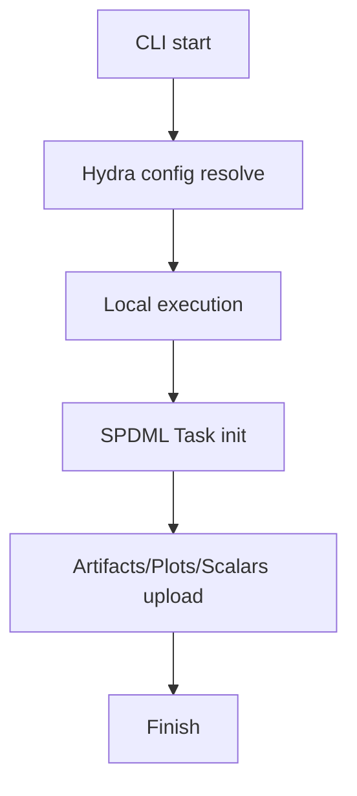

# Local実行＋SPDML結果登録の処理フロー（概要）

## 1. 処理フロー（Mermaid）

## 2. SPDMLのプロジェクト階層
| 階層 | 内容 | 代表タスク/データ |
| --- | --- | --- |
| project_root | `run.clearml.project_root` | 例: MFG |
| solution_root | `run.clearml.project_layout.solution_root` | TabularAnalysis |
| usecase_id | `run.usecase_id` | usecase単位 |
| process_group | `group_map`で定義 | dataset/preprocess/train など |

## 3. 複数タスクの実行構成
- local/loggingでは **local_sequential** が preprocess → train → leaderboard を逐次実行。
- 各工程は独立タスクとして SPDML に記録される。

## 4. ユーザー操作ぶれへの工夫
- タグ/Properties/HyperParams を統一し UI表示を固定。
- `config_resolved.yaml / out.json / manifest.json` を必須出力。
- `run.clearml.execution` で実行モードを明示。
