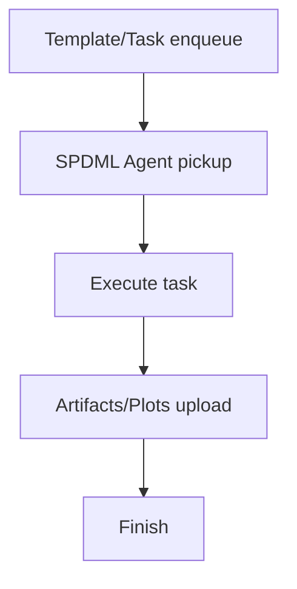

# SPDMLAgent実行結果登録の処理フロー

## 1. 処理フロー（Mermaid）

## 2. SPDMLのプロジェクト階層
| 階層 | 内容 | 代表タスク/データ |
| --- | --- | --- |
| project_root | `run.clearml.project_root` | 例: MFG |
| solution_root | `run.clearml.project_layout.solution_root` | TabularAnalysis |
| usecase_id | `run.usecase_id` | usecase単位 |
| process_group | `group_map`で定義 | dataset/preprocess/train など |

## 3. 複数タスクの実行構成
- `run.clearml.execution=pipeline_controller` の場合、controllerが子タスクを生成。
- 子タスクは template clone を前提に作成。

## 4. ユーザー操作ぶれへの工夫
- templateタスクを固定し、clone時にパラメータのみ差分上書き。
- タグ/Properties を統一し、UI検索性を維持。
